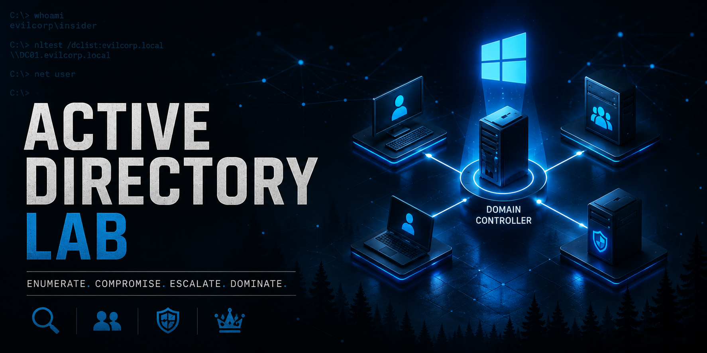
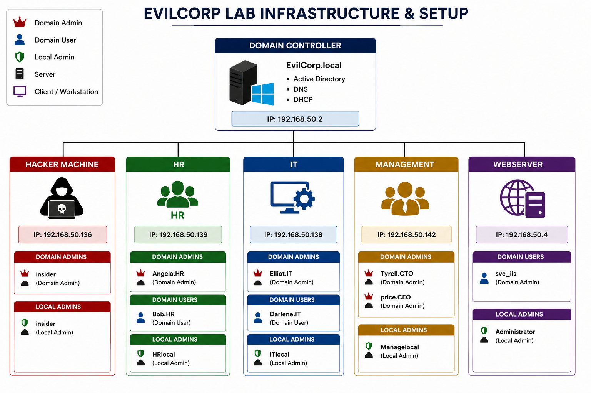
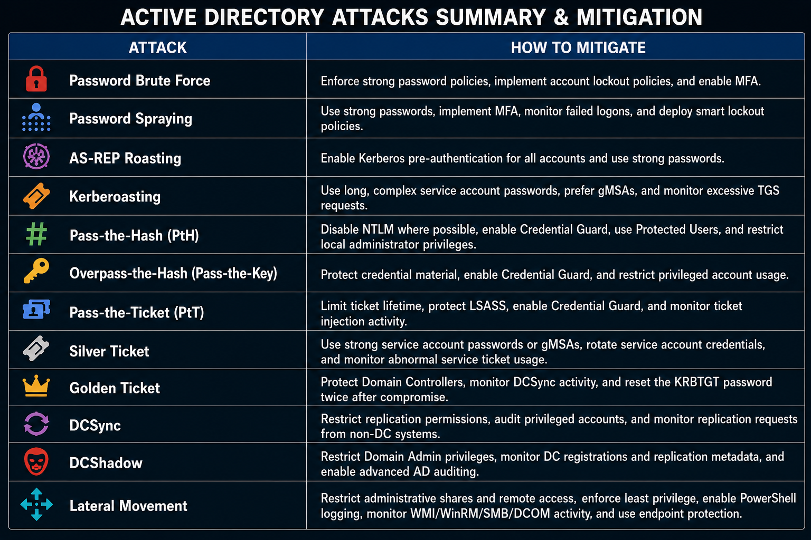

<p align="center">
  <h1 align="center">Active Directory Lab</h1>

  

  <p align="center">
    A complete hands-on Active Directory lab demonstrating modern attack techniques, Kerberos abuse, credential theft, and lateral movement in an enterprise environment.
  </p>
</p>

> ⚠️ **Disclaimer**
>
> This project was created for educational purposes only inside an isolated virtual lab environment. It is intended to help students, penetration testers, and defenders better understand Active Directory attack techniques and their corresponding mitigations.

---

# 📖 Full Documentation

The complete walkthrough, explanations, screenshots, and attack demonstrations are available on Notion.

**🔗 Notion Documentation:**  
> (https://www.notion.so/Active-Directory-Its-Attacks-389d8b0f2d9880679567f17f49d61941?source=copy_link)

---

# 📌 Project Overview

This project simulates a realistic enterprise Active Directory environment (**EvilCorp.local**) containing multiple workstations, servers, users, organizational units, and services.

The objective is to understand how attackers compromise Windows domains by abusing authentication protocols, Active Directory misconfigurations, credential attacks, and lateral movement techniques.

Each attack includes:

- Attack overview
- Prerequisites
- Internal protocol explanation
- Step-by-step execution
- Screenshots

---

# 🖥️ Lab Infrastructure

The environment consists of:

- Domain Controller
- IIS Web Server
- HR Workstation
- IT Workstation
- Management Workstation
- Hacker Machine (Kali Linux)

<p align="center">

</p>

---

# 🔐 Kerberos Authentication Workflow

Understanding the Kerberos authentication process is essential before exploring the attacks.

The following diagram illustrates the complete Kerberos authentication workflow,and the tickets exchange between the client and the Key Distribution Center (KDC).

<p align="center">
  
</p>

---

# 🔥 Demonstrated Attacks

- Enumeration
- Password Attacks
  - Brute Force
  - Password Spraying
- AS-REP Roasting
- Kerberoasting
- Pass-the-Hash
- Overpass-the-Hash
- Pass-the-Ticket
- DCSync
- DCShadow
- Silver Ticket
- Golden Ticket
- Lateral Movement
  - WMI
  - WinRM
  - PsExec

---

# 📚 Topics Covered

This lab demonstrates:

- Active Directory enumeration
- Kerberos internals
- NTLM authentication
- Credential theft techniques
- Kerberos ticket attacks
- Credential replay attacks
- Active Directory replication abuse
- Lateral movement
- Privilege escalation
- Defensive mitigations

---

# 🛠️ Tools Used

### Offensive Security

- Mimikatz
- Rubeus
- PowerView
- CrackMapExec
- Evil-WinRM
- PsExec

### Password Cracking

- Hashcat

---

# 📂 Repository Structure

```text
Active-Directory-Lab/
│
├── Images/
│   ├── Architecture.png
│   ├── Banner.png
│   ├── Kerberos Authentication.png
│   └── Mitigations.png
│
├── Scripts/
│   ├── Enumeration.ps1
│   ├── EvilCorp Portal.html
│   └── Reverse_Shell.py
│
├── Wordlists/
│   ├── Passwords.txt
│   └── Usernames.txt
│
├── Tools/
│   └── Lab_Tools.7z
│      Password: ActiveDirectoryLab
│
└── README.md
```

---

# 🛡️ MITRE ATT&CK Coverage & Mitigation

This project covers techniques across multiple MITRE ATT&CK tactics, including:

- Initial Access
- Credential Access
- Discovery
- Lateral Movement
- Privilege Escalation
- Defense Evasion

Also highlights the primary defensive measures for each attack. The following matrix summarizes the recommended mitigations that help reduce the risk of compromise in an Active Directory environment.

<p align="center">
  
</p>

---

# 👨‍💻 Author

## Samuel4O4

*Cybersecurity Geek*

---

⭐ **If you found this project useful, consider giving the repository a star!**
